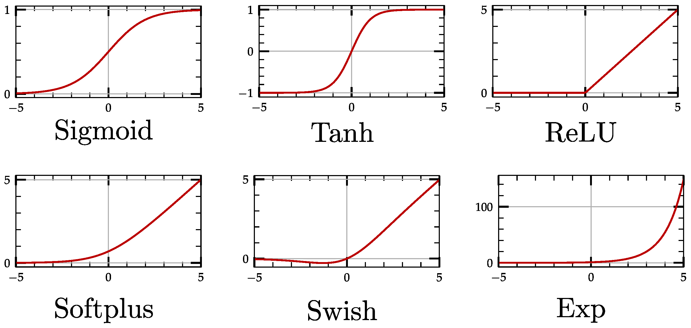

# Activation Functions in Deep Learning

Activation functions introduce non-linearity into neural networks, allowing them to learn complex mappings from inputs to outputs. Without activation functions, a neural network would simply be a linear model regardless of how many layers it has.

---

## Why Activation Functions?

- They **break linearity** and allow the network to approximate complex functions.
- They **control gradient flow** during backpropagation.
- They influence how **fast or stable** a model trains.

---

## Common Activation Functions

### 1. **ReLU (Rectified Linear Unit)**

$$ \text{ReLU}(x) = \max(0, x) $$

**Continuity**

ReLU is **continuous** everywhere.  
- There is no jump or gap in the function.  
- At `x = 0`, ReLU(0) = 0, so the function value is well-defined.

**Differentiability**

ReLU is **not differentiable** at `x = 0`.

- For `x > 0`: derivative = 1
- For `x < 0`: derivative = 0
- At `x = 0`: the left derivative ≠ right derivative → **no unique derivative**

At `x = 0`, ReLU has a **kink** (sharp corner), which makes it non-smooth and non-differentiable at that point.

**Pros:**
- Simple and fast (just a max operation)
- Sparse activations (some neurons output 0)  
- Helps with vanishing gradient problem (compared to sigmoid/tanh)

**Cons:**
- "Dying ReLU" problem: If too many neurons output `0`, they stop learning — common in networks with high learning rates or poor initialization.

---
## 2. **PReLU (Parametric Rectified Linear Unit)**

$$
\mathrm{PReLU}(x) =
\begin{cases}
x, & x \ge 0,\\
a\,x, & x < 0,
\end{cases}
$$

where `a` is a learnable parameter (often initialized to a small positive value, e.g. `0.25`).

**Pros:**
- **Learnable negative slope**  
  The parameter `a` lets the network adapt how “leaky” the activation is for `x < 0`, rather than forcing it to zero.
- **Mitigates dying-ReLU**  
  Even for negative inputs, gradients flow (`∂/∂x = a ≠ 0`), so units are less likely to get stuck at zero.
- **Often improves accuracy**  
  By tuning the negative response per channel or layer, networks can fit data more flexibly.

**Cons:**
- **Extra parameters**  
  Introduces one (or more) `a` values per layer/channel, increasing model capacity and memory.
- **Risk of overfitting**  
  More freedom can lead to fitting noise if regularization is insufficient.
- **Slightly higher compute cost**  
  You must update and store the `a`-parameters during training.
- **Initialization sensitivity**  
  Poor initial choice of `a` can hurt early training dynamics (common default: `0.25`).
- **Still piecewise linear**
---

### 3. **Sigmoid**

## Sigmoid (Logistic) Activation

$$
\mathrm{sigmoid}(x) = \frac{1}{1 + e^{-x}}
$$

**Pros:**
- Smooth
- Output range (0, 1), useful for probabilities

**Cons:**
- Vanishing gradient for large |x|
- Saturates at 0 or 1
- Slow learning in deep networks

---

### 4. **Tanh**

$$
\tanh(x) = \frac{e^x - e^{-x}}{e^x + e^{-x}}
$$

**Pros:**
- Output range (-1, 1)
- Centered around 0 (better than sigmoid for hidden layers)

**Cons:**
- Still suffers from vanishing gradients

---

### 5. **SiLU (Swish)**

$$
\text{SiLU}(x) = x \cdot \sigma(x) = x \cdot \frac{1}{1 + e^{-x}}
$$

**Pros:**
- Smooth
- Non-monotonic
- No saturation for positive x
- Allows small negative values
- Helps gradient flow better
- Outperforms ReLU in modern architectures (EfficientNet, Transformers)

**Cons:**
- Slightly more expensive to compute than ReLU

---

## Comparison Table

| Function    | Smooth | Monotonic | Saturation | Output Range |
|-------------|--------|-----------|------------|--------------|
| ReLU        | No     | Yes       | No         | [0, ∞)       |
| Leaky ReLU  | No     | Yes       | No         | (-∞, ∞)      |
| Sigmoid     | Yes    | Yes       | Yes        | (0, 1)       |
| Tanh        | Yes    | Yes       | Yes        | (-1, 1)      |
| SiLU (Swish)| Yes    | No        | No         | (-∞, ∞)      |

---

## Practical Tips

- Use **ReLU** as the default for simple networks.
- Use **SiLU (Swish)** or **GELU** for modern deep networks (Transformers, EfficientNet).
- Avoid **sigmoid** in hidden layers (use only for output when modeling probabilities).
- Use **LeakyReLU** if experiencing "dying ReLU" problem.

---

